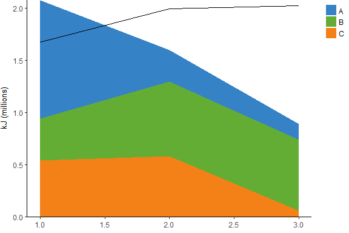

<!-- README.md is generated from README.Rmd. Please edit that file -->
[](https://doi.org/10.5281/zenodo.1186370)

bioenergmod
===========

The bioenergmod package contains a set of functions developed for
bioenergetics modeling, to compare the daily energy requirements of a
wildlife population of interest to the daily energy supply available,
taking into account dynamic habitat availability and consumption in
previous time steps. This was primarily developed with wetland-dependent
shorebirds in mind, to account for variation in the proportion of
potential habitat that is flooded (i.e. has open water) and variation in
the proportion of the open water that is accessible (i.e. shallow enough
for use by foraging shorebirds).

References
----------

For details on the model’s structure:  
Dybala KE, Reiter ME, Hickey CM, Shuford WD, Strum KM, Yarris GS. 2017.
A bioenergetics modeling approach to setting conservation objectives for
non-breeding shorebirds in California’s Central Valley. <i>San Francisco
Estuary and Watershed Science</i> 15(1). Available from:
<https://doi.org/10.15447/sfews.2017v15iss1art2>

Features
--------

-   Accommodates multiple land cover types with differing availability
    and foraging value
-   Accommodates tracking energy supply in all available habitat
    vs. accessible habitat (e.g. if only a proportion of available
    habitat is also accessible)
-   Includes option for Monte Carlo simulation
-   Includes plotting function

Installation
------------

You can install this package directly from R using the **devtools**
package:

``` r
devtools::install_github("kdybala/bioenergmod")
```

Example
-------

``` r
library(bioenergmod)

## 1. Calculate daily energy requirements for a shorebird from population size
##   (n), average individual body mass (kg), and assimilation efficiency.
energy.need = calculate_energy_demand(
  n = c(5000, 7000, 10000), bodymass = c(0.1, 0.08, 0.05), 
  metabolism='FMR', assimilation=0.73, plot=FALSE)

## 2. Specify foraging value (kJ/ha) of each land cover type:
energy.density = data.frame(
  habitat = c('A', 'B', 'C'), 
  value = c(20, 15, 12))

## 3. Quantify dynamics of foraging habitat availability:
##    --total area of each land cover type (ha)
total.area = data.frame(
  habitat = c('A', 'B', 'C'), 
  area = c(70000, 150000, 100000))

##    --proportion of total area that is available at each time step 
##      (e.g., flooded)
prop.openwater = data.frame(
  habitat = c(rep('A', 3), rep('B', 3), rep('C', 3)), 
  yday = rep(c(1:3), 3), 
  value = c(0.9, 0.85, 0.95, 
            0.2, 0.5, 0.8, 
            0.5, 0.9, 0.7))

##    --proportion of available area that is accessible at each time step 
##      (e.g. suitable depth)
prop.accessible = data.frame(
  habitat = c(rep('A', 3), rep('B', 3), rep('C', 3)), 
  yday = rep(c(1:3), 3), 
  value = rep(0.9, 9))

## 4. Calculate daily change in foraging habitat availability:
change = calculate_habitat_change(
  tothabitat = total.area, flood = prop.openwater, time = 'yday',
  value = 'value', accessible = prop.accessible, wetsplit = F)

## 5. Run bioenergetics model:
results = run_bioenergmod_loop(
  energyneed = energy.need, 
  energydens = energy.density, 
  habitat.available = change$openwater, 
  habitat.accessible = change$accessible,
  habitat.added = change$added, 
  habitat.returned = change$returned,
  prop.accessible = change$prop.accessible)

## 6. Plot accessible energy supply against daily energy requirement at each 
##    time step:
plot_bioenergmod(
  results$energy.accessible, scale = 1000000, ylab = 'kJ (millions)', 
  der = energy.need, palette = c('#3682C7', '#64AD34', '#F38118')) +
  ggplot2::theme(legend.position = 'right')
```


